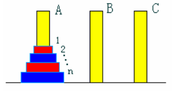

# 第02次上机实验题目

> [!NOTE]
> 本文档为 第02次上机实验题目 的上机实验题目说明，已按照排版指南进行格式优化。

---

通过自主设计算法，编程解决下列问题：

---

## 一、 数组元素排序：【问题描述】给定n个元素，设计算法实现从小到大排序。

### 输入格式
第一行元素个数n，第二行输入n个元素。

### 输出格式
按小到大排好序的元素

### 样例输入
```text
3
15 12 20
```

### 样例输出
```text
12 15 20
```

---

## 二、 双色汉诺塔问题：【问题描述】设 A、B、C 是 3 个塔座。开始时，在塔座 A 上有一叠共 n 个圆盘，这些圆盘自下而上， 由大到小地叠在一起。各圆盘从小到大编号为 1，2，……，n，奇数号圆盘着蓝色，偶数号圆盘着红色，如图所示。现要求将塔座 A 上的这一叠圆盘移到塔座 B 上，并仍按同样顺序叠置。在移动圆盘时应遵守以下移动规则：

规则(1)：每次只能移动 1 个圆盘；

规则(2)：任何时刻都不允许将较大的圆盘压在较小的圆盘之上；

规则(3)：任何时刻都不允许将同色圆盘叠在一起；

规则(4)：在满足移动规则(1)-(3)的前提下，可将圆盘移至 A，B，C 中任一塔座上。

<div align="center">
  
</div>

### 输入格式
输入圆盘个数n

### 输出格式
每一行由一个正整数 k 和 2 个 字符 c1 和 c2 组成，表示将第 k 个圆盘从塔座 c1 移到塔座 c2 上

### 样例输入
```text
3
```

### 样例输出
```text
```

---

## 一、 A B

---

## 二、 A C

---

## 一、 B C

---

## 三、 A B

---

## 一、 C A

---

## 二、 C B

---

## 一、 A B
