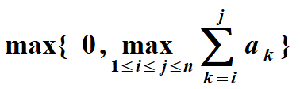

# 第09次上机实验题目（最大字段和问题与最优二分检索树）

> [!NOTE]
> 本文档为 第09次上机实验题目（最大字段和问题与最优二分检索树） 的上机实验题目说明，已按照排版指南进行格式优化。

---

利用动态规划算法实现

最大字段和

### 问题描述

给定n 个整数（可以为负数）的序列<a1, a2, … , an>，求：

<div align="center">
  
</div>

### 输入格式
输入整数个数n，整数序列

### 输出格式
最大字段和及相应子序列

### 样例输入
```text
6
-2 11 -4 13 -5 -2
```

### 样例输出
```text
20
```

---

## 11、 -4 13

最优二分检索树

### 问题描述

数据集 S＝< 1, 2, ..., n >

存取概率分布P = < a0, b1, a1, b2, … , ai, bi+1, …, bn, an >, 求一棵最优的(即平均比较次数最少的)二分检索树.

假设 m[i,j] 是相对于输入 S[i,j] 和 P[i,j] 的最优二叉搜索树的平均比较次数，令m[i,i-1]=0.

### 输入格式
输入数据结点个数n，空隙结点及数据结点存取概率

### 输出格式
最优二叉搜索树的先序遍历结果

### 样例输入
```text
5
0.04 0.1 0.02 0.3 0.02 0.1 0.05 0.2 0.06 0.1 0.01
```

### 样例输出
```text
2 1 4 3 5
```
