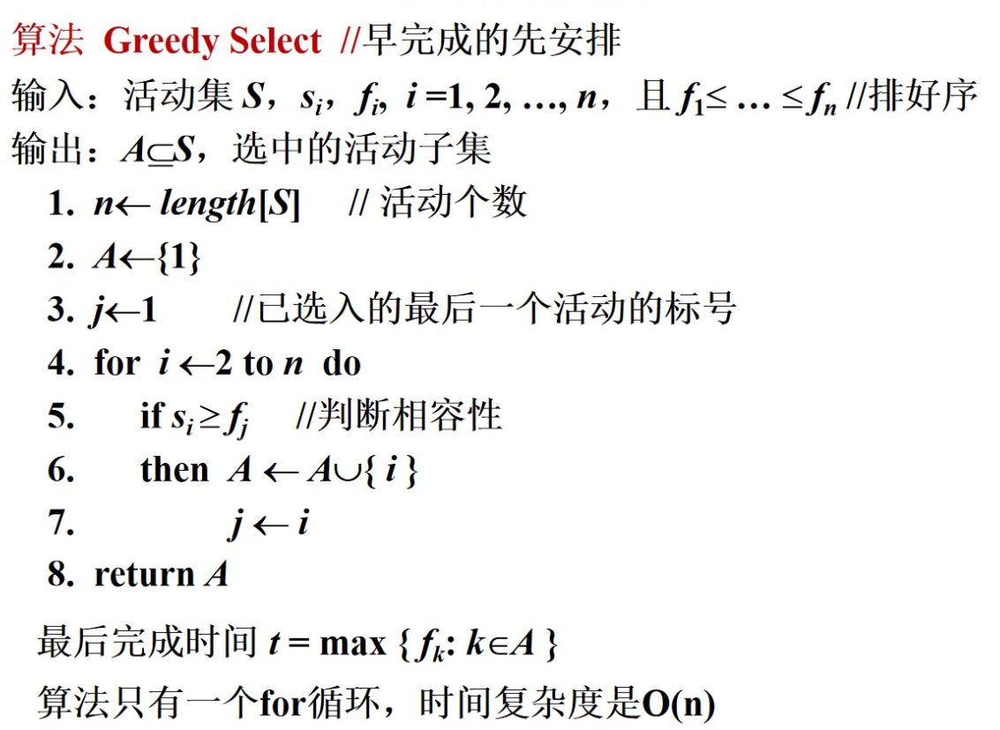
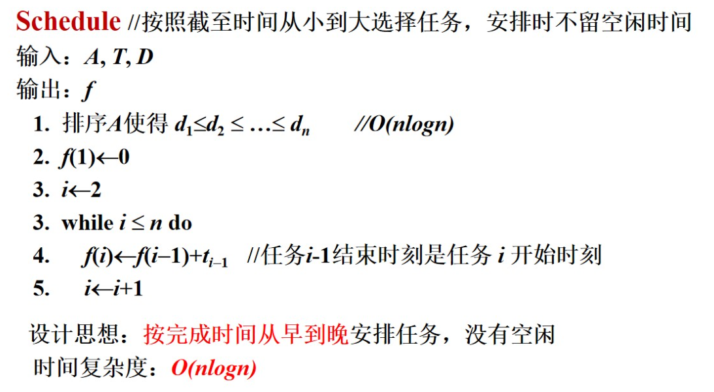

# 贪心法

> [!NOTE]
> 本文档为 贪心法 的上机实验题目说明，已按照排版指南进行格式优化。

---

---

## 一、 贪心法求活动选择问题(使用cpp)

### 问题描述

设S ={1, 2, … , n}为活动的集合, $si$,  $fi$  分别为活动 i 的开始和结束时间， i =1, 2, … , n.  定义：活动 i 与 j 相容 Û $si$ ³ $fj$  或 $sj$ ³ $fi$ .

求：最大的两两相容的活动集 A.

### 输入格式
活动个数n，第i个活动的序号i、开始时间及结束时间。

### 输出格式
符合要求的活动顺序

### 样例输入
```text
10
1 2 6
2 3 5
3 1 4
4 5 7
5 4 9
6 5 9
7 6 10
8 8 11
9 8 12
10 2 13
```

### 样例输出
```text
3 4 8
```

### 样例说明

### 评分标准

<div align="center">
  
</div>

---

## 二、 贪心法最小延迟调度(使用cpp)

### 问题描述
给定等待服务的客户集合A={1,2，… , n}, 预计对客户i的服务时间是ti, 该客户希望的完成时间是di, 即T=<t1,t2，…,tn>, D=<d1, d2,… ,dn>.  如果对客户i的服务在di之前结束, 那么对客户i的服务没有延迟;如果在di之后结束, 那么这个服务就被延迟了, 延迟的时间等于该服务结束时间减去di . 假设ti, di都是正整数, 一个调度函数f : A®N，f(i)为对客户i的服务开始的时间, 要求所有区间(f(i), f(i)+ti)互不重叠. 一个调度f 的最大延迟是所有客户延迟时间的最大值. 求最大延迟达到最小的调度f .【输入形式】客户人数n，各客户服务时间及期望完成时间

### 输出格式
最小延迟时间调度安排及延迟时间

### 样例输入
```text
5
5 8 4 10 3
10 12 15 11 20
```

### 样例输出
```text
1 4 2 3 5
12
```

### 样例说明

### 评分标准

<div align="center">
  
</div>
