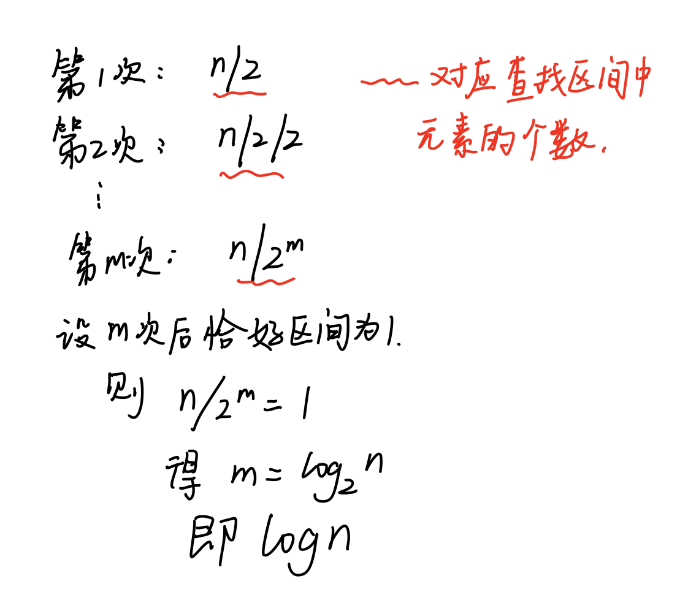
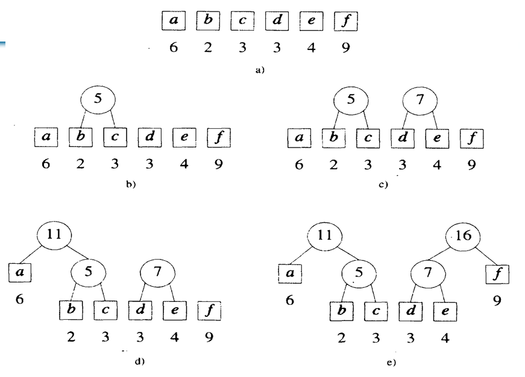
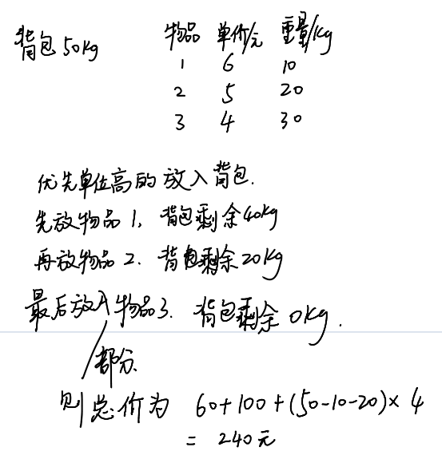
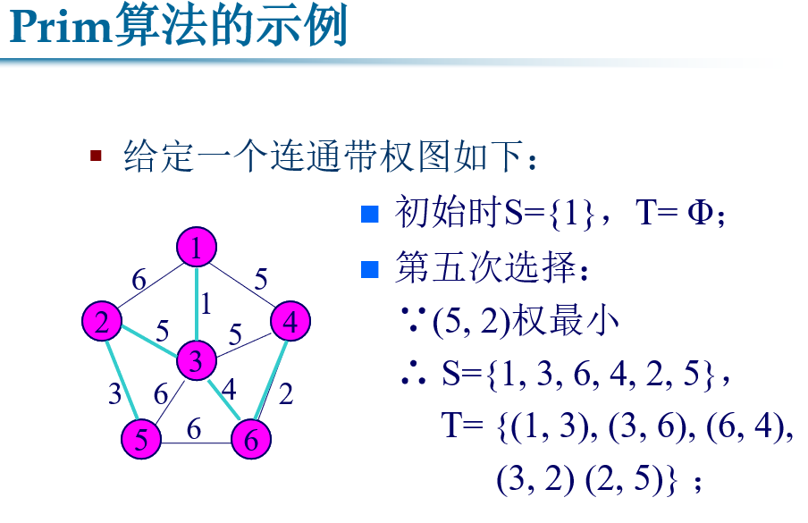
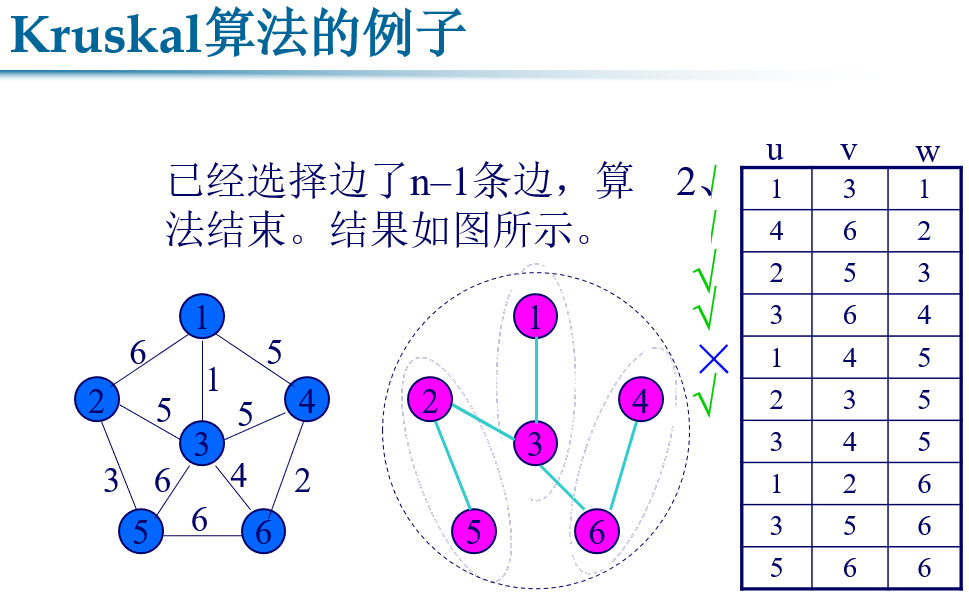
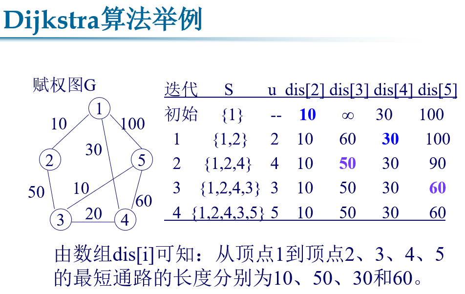
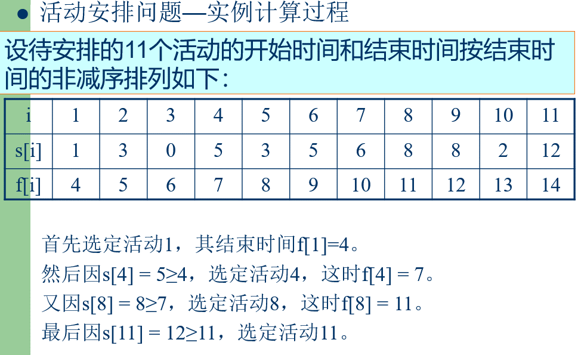
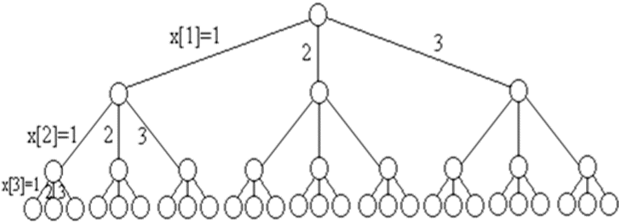

# 算法设计与分析考前预测与核心简答

> [!NOTE]
> 本文档汇总了算法设计与分析课程考前预测的核心问答与典型算法题目。
> 
> * 包含核心简答（贪心与动态规划比较、回溯与分支限界比较、剪枝函数作用等）。
> * 附带手绘/图表分析（已转换并优化为居中的 HTML 对齐图片）。
> * 包含上机题（虚拟加油最少次数、半数集问题）的优化 C++ 实现与分析。

---

## 一、 核心简答与对比

### 1. 贪心算法和动态规划的异同（比较）

* **共同点**：
  - 两者均要求问题具有**最优子结构性质**，即问题的最优解包含其子问题的最优解。
  - 两者均是通过将原问题分解为若干个子问题，先求解子问题，进而求出原问题的解。

* **多维度对比矩阵**：

| 对比维度 | 贪心算法 | 动态规划 |
| :--- | :--- | :--- |
| **贪心选择性质** | **具有**。每一步都做出当前看起来最好的选择（局部最优），并期望由此产生全局最优解。 | **不一定具有**。当前的局部最优选择不一定会导致全局最优，必须从全局进行权衡。 |
| **子问题重叠** | **不一定具有**。通常每次贪心选择后，仅面临一个非空的子问题。 | **必须具有**。子问题空间要足够小，使得许多子问题在求解过程中被反复计算。 |
| **求解方向** | **自顶向下**。通过一系列贪心选择逐步将问题简化。 | **自底向上**（或带备忘录的自顶向下）。先求小子问题，再由子问题的解组合出大问题的解。 |
| **执行效率** | **通常较高**。只需做出局部最优的一步选择，不涉及状态转移和回溯。 | **相对较低**。需要计算并记录所有可能的状态和子问题。 |

---

### 2. 剪枝函数的作用

回溯法与分支限界法在搜索问题的解空间树时，为了避免无效搜索，会采用**剪枝函数**来裁剪不必要的子树，从而显著减少问题的运算量。剪枝函数主要分为以下两类：

* **约束函数 (Constraint Function)**：
  - **作用**：在左子树（通常是包含当前元素的分支）判断当前选择是否满足问题的**显约束**和**隐约束**。如果不满足，则剪去该子树。
  - *典型应用*：N 皇后问题中判断当前皇后放置是否冲突。
* **限界函数 (Bound Function)**：
  - **作用**：在右子树（通常是不包含当前元素的分支）评估当前已选值加上剩余元素的最大可能增益（如价值），如果该最大可能增益**小于或等于**当前已找到的最优解的值，则剪去该子树（因为该分支绝不可能产生比当前解更优的解）。
  - *典型应用*：0-1 背包问题中评估当前价值与剩余最大期望价值之和是否大于 `bestp`。

---

### 3. 回溯法和分支限界法的异同

* **相同点**：
  - 均需要明确定义问题的**解空间**（通常组织为树或图）。
  - 均在解空间上搜索问题解。
  - 在搜索最优解之前，均需明确**判定条件**（如限界函数、约束条件）。
  - 搜索过程中均会通过剪枝函数删除（裁剪）不合法的分支，保留有希望产生最优解的节点。

* **不同点**：

| 对比维度 | 回溯法 | 分支限界法 |
| :--- | :--- | :--- |
| **搜索目标** | 找出解空间中满足约束条件的**所有解**。 | 找出满足约束条件的**一个解**，或在满足约束条件的解中找到**最优解**。 |
| **搜索方式** | **深度优先搜索** (DFS)。以系统且跳跃的方式向深度方向推进。 | **广度优先** (BFS) 或 **最小耗费/最大效益优先**。以层序方式展开。 |
| **扩展方式** | 扩展结点一次只生成一个子结点，如果活结点不能再向深处扩展，则回溯。 | 扩展结点一次生成**所有的孩子结点**（分支），并将它们加入活结点表。 |
| **存储空间** | **较小**。只需 $O(n)$ 级别的调用栈空间。 | **较大**。需要维护一个活结点表（队列或堆），在节点树极其庞大时易造成内存溢出。 |

---

## 二、 核心算法图解与分析

### 1. 二分查找法的时间复杂度分析

二分查找法通过将搜索区间不断减半来定位目标元素，在最坏情况下的比较次数可以通过如下步骤推导。

<div align="center">
  
  <p><em>图 1：二分查找时间复杂度推导过程</em></p>
</div>

---

### 2. 哈夫曼编码

哈夫曼编码构建一棵满二叉树，其权值路径长度最小（WPL 最小）。下图展示了根据一组频率字符集构建哈夫曼树的合并过程。

<div align="center">
  
  <p><em>图 2：哈夫曼树构建与编码分配</em></p>
</div>

---

### 3. （0-1）背包问题

给出一个具体的背包问题，可以通过动态规划填表法计算出最大价值。下图为某具体 0-1 背包问题的价值决策矩阵（填表示意图）。

<div align="center">
  
  <p><em>图 3：0-1 背包问题动态规划决策矩阵</em></p>
</div>

---

### 4. 最小生成树

最小生成树包含图的所有顶点，且总边权最小。常用的求解算法包括 Prim 算法（加点法，适合稠密图）和 Kruskal 算法（加边法，适合稀疏图）。

<div align="center">
  
  
  <p><em>图 4 & 5：最小生成树算法执行步骤演示</em></p>
</div>

---

### 5. 单源最短路径

Dijkstra 算法利用贪心思想，通过逐步松弛边来寻找从起点到所有其他顶点的最短距离。

<div align="center">
  
  <p><em>图 6：Dijkstra 算法单源最短路径查找过程</em></p>
</div>

---

### 6. 活动安排问题

活动安排问题利用贪心算法，每次选择具有**最早结束时间**且与已选择活动兼容的活动，从而安排尽可能多的活动。

<div align="center">
  
  <p><em>图 7：活动区间贪心选择图解</em></p>
</div>

---

### 7. 图的 m 着色问题

图的着色问题求解在给定的 $m$ 种颜色下，使得相邻顶点颜色不同的可行方案。求解过程通常采用回溯法在排列/子集树（解空间树）上进行搜索。

<div align="center">
  
  <p><em>图 8：图的 3 着色解空间树及可行解搜索路径</em></p>
</div>

---

### 8. 设计动态规划算法的主要步骤

1. **寻找最优解的性质**：刻画最优解的结构特征。
2. **递归地定义最优值**：建立状态转移方程（核心）。
3. **计算最优值**：通常以**自底向上**的方式计算（填表），并记录中间决策信息。
4. **构造最优解**：根据计算最优值时得到的信息，从终状态逆向回溯构造出完整的解（该步骤可根据题目要求选择性执行）。

---

## 三、 上机经典题目实现

### 1. 虚拟加油问题（最少加油次数）

#### 问题描述
一辆汽车加满油后可行驶 $d$ 公里，旅途中有若干个加油站，设计算法求出使汽车到达终点的最少加油次数。

#### 贪心策略
汽车能够到达下一个加油站就不加油，只有在当前的油量不足以支撑行驶到下一个加油站时，才在前一个加油站将油加满。

#### C++ 代码实现
```cpp
#include <iostream>
#include <vector>
using namespace std;

// length: 加满油后最远能行驶的距离
// number: 加油站个数
// group: 相邻加油站之间的距离数组，group[0]为起点到第一个加油站的距离，
//        group[i]为加油站i到i+1的距离，group[number]为最后一个加油站到终点的距离
int MinRefuelTimes(int length, int number, const vector<int>& group) {
    int count = 0;
    int sum = 0;
    
    for (int j = 0; j <= number; j++) {
        // 如果两个站之间的距离大于油箱容量，汽车不可能到达终点
        if (group[j] > length) {
            return -1;
        }
        
        sum += group[j];
        if (sum > length) {
            // 当前累计距离超出了一箱油的最大行程，必须在前一个站加油
            count++;
            sum = group[j]; // 在加油站加油后，重新开始累计距离
        }
    }
    
    return count;
}

int main() {
    int length = 7;
    int number = 7;
    // 起点与加油站、加油站与终点间距离
    vector<int> group = {1, 2, 3, 4, 5, 1, 6, 2};
    
    int ans = MinRefuelTimes(length, number, group);
    if (ans == -1) {
        cout << "无法到达终点！" << endl;
    } else {
        cout << "最少加油次数: " << ans << " 次" << endl;
    }
    return 0;
}
```

---

### 2. 半数集问题

#### 问题描述
给定一个自然数 $n$，定义半数集 $set(n)$ 如下：
1. $n \in set(n)$；
2. 在 $n$ 的左边加上一个自然数 $d$，但 $d \le n / 2$；
3. 按照此规则递归添加，直到不能添加为止。
求半数集 $set(n)$ 的元素个数。

#### C++ 递归与记忆化搜索实现
```cpp
#include <iostream>
#include <vector>
using namespace std;

// 1. 纯递归实现（存在大量重复子问题计算，时间复杂度呈指数增长）
int SetNum(int n) {
    int num = 1; // 包含 n 本身
    if (n == 1) return 1;
    for (int i = 1; i <= n / 2; i++) {
        num += SetNum(i);
    }
    return num;
}

// 2. 记忆化搜索（动态规划思想，时间复杂度降为多项式级别 O(n^2)）
int SetNumMemo(int n, vector<int>& memo) {
    if (memo[n] > 0) return memo[n]; // 已计算过直接返回
    
    int num = 1;
    for (int i = 1; i <= n / 2; i++) {
        num += SetNumMemo(i, memo);
    }
    
    memo[n] = num; // 记录计算结果
    return num;
}

int main() {
    int n = 6;
    
    // 纯递归计算
    cout << "递归求解 set(" << n << ") 大小: " << SetNum(n) << endl; // 对应集合 {6, 16, 26, 126, 36, 136}
    
    // 记忆化搜索求解
    vector<int> memo(n + 1, 0);
    cout << "记忆化求解 set(" << n << ") 大小: " << SetNumMemo(n, memo) << endl;
    
    return 0;
}
```
